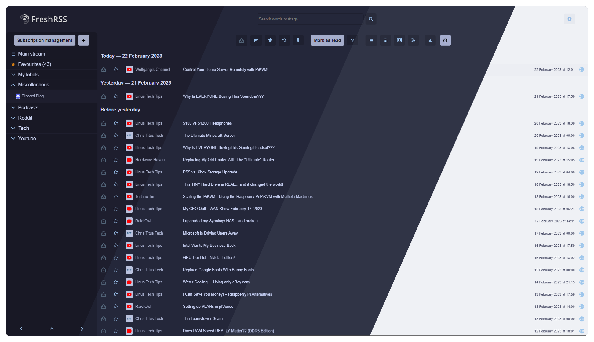
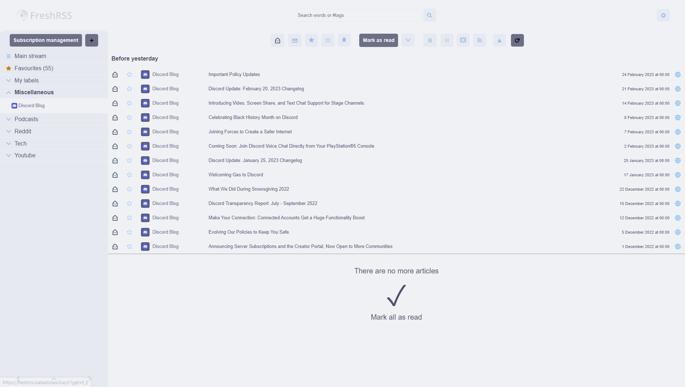
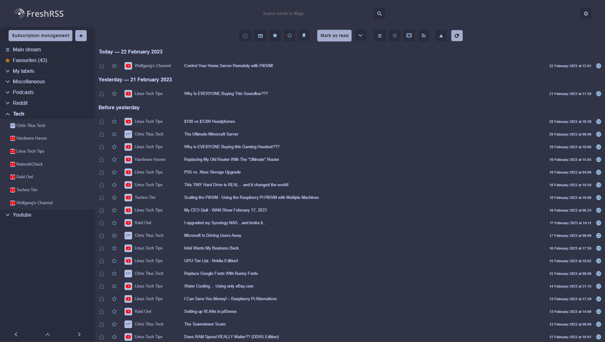
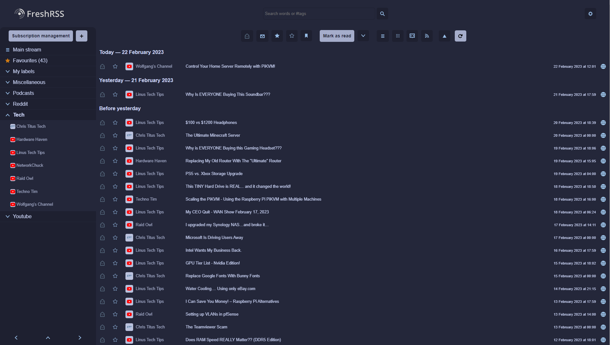
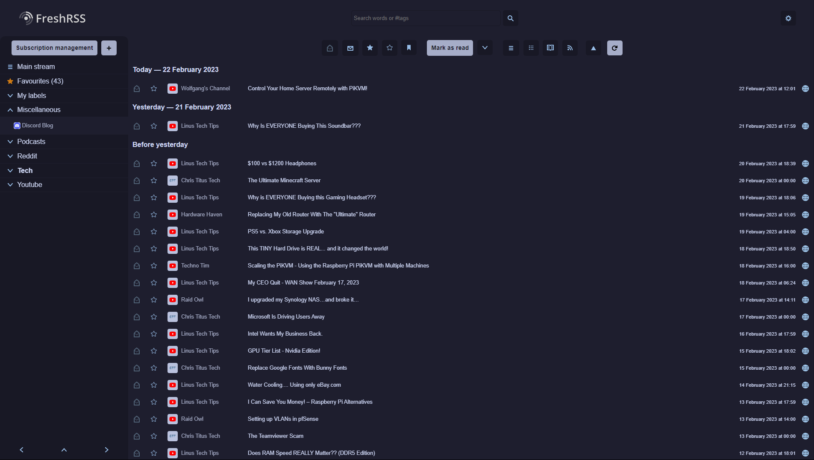

<h3 align="center">
	 
	
	Catppuccin for <a href="https://freshrss.org">FreshRSS</a>
	
</h3>

	
	
	

	

## Previews

🌻 Latte

	

🪴 Frappé

	

🌺 Macchiato

		

🌿 Mocha

	

## Usage

1. Copy your desired palette(s) from `palettes` 🗂️
   - 🌻 [Latte](palettes/latte.css)
   - 🪴 [Frappé](palettes/frappe.css)
   - 🌺 [Macchiato](palettes/macchiato.css)
   - 🌿 [Mocha](palettes/mocha.css)
2. Navigate to display and change the theme to Nord
3. Then go to extentions and ensure you have installed the CustomCSS plugin
4. Click the gear icon and paste the CSS of the Catppuccin theme flavor of your choice
5. Click submit and refresh the page and your done

## 💝 Thanks to

- [Isabel Roses](https://github.com/isabelroses)

&nbsp;

	

	Copyright &copy; 2021-present <a href="https://github.com/catppuccin" target="_blank">Catppuccin Org</a>

	

